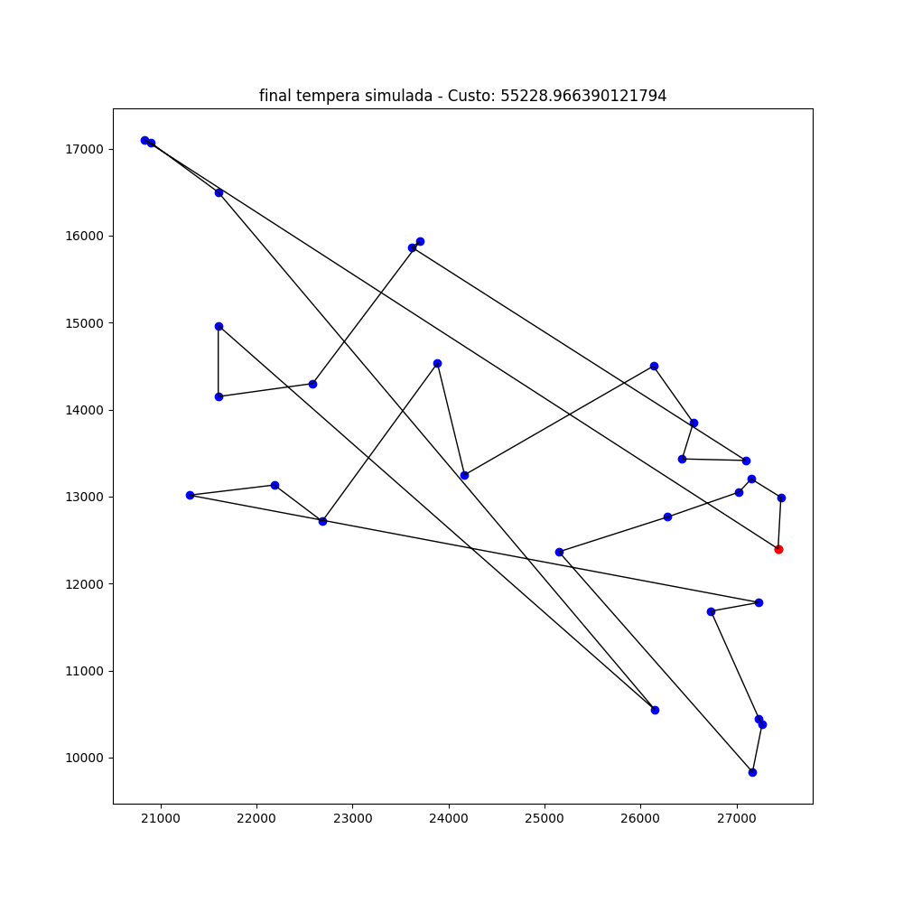

# Algoritmos de busca local para resolver problema do caixeiro viajante

Os algoritmos utilizados são:
  - Subida da encosta ([Hill climbing algorithm](https://en.wikipedia.org/wiki/Hill_climbing))
  - Têmpera simulada ([Simulated annealing](https://en.wikipedia.org/wiki/Simulated_annealing))
  - Algoritmo genético([Genetic algorithm](https://en.wikipedia.org/wiki/Genetic_algorithm))
  
 # Resultados
 
 Os resultados abaixo foram obtidos pela base de dados das cidades do [Western Sahara](http://www.math.uwaterloo.ca/tsp/world/countries.html).
 
 
 
 ## Subida da encosta
 
 
 
  ## Têmpera simulada
  
 
 
 ## Algoritmo Genético
 
 
 
 # Referências
 
 Foi útilizado como refêrencia as aulas da Professora Débora da Conceição Araújo. Além disso, também foi utilizado os seguintes livros:
 
  - NORVIG, P.; RUSSELL, S. Inteligência Artificial. Elsevier, 3a ed., 2013.
